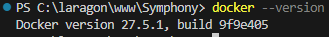
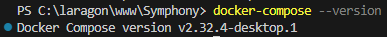

- # **Etape A :**  
  
# Etape 1 : Préparer l'environnement :  
  
- **Installer Docker et Docker compose :**  
  
Pour vérifier que Docker est installé et configurer, ouvrir un terminal et entrer :  
```
docker --version
```  
  
Résultat si docker est installé :  
    
  
  
-----------------------------------------------------------------------------------------------------------------------------------------------Pour vérifier que Docker Compose est installé et configurer, ouvrir un terminal et entrer :
```
docker-compose --version
```  
  
Résultat sit Docker compose est installé :  
  
  
