- # **Etape A :**  
  
# Etape 1 : Préparer l'environnement :  
  
- **Installer Docker et Docker compose :**  
  
Pour vérifier que Docker est installé et configuré, ouvrir un terminal et entrer :  
```
docker --version
```  
  
Résultat si docker est installé :  
    
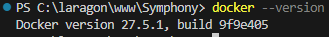  
  
-----------------------------------------------------------------------------------------------------------------------------------------------
Pour vérifier que Docker Compose est installé et configurer, ouvrir un terminal et entrer :
```
docker-compose --version
```  
  
Résultat sit Docker compose est installé :  
  
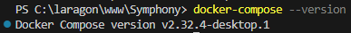  

-----------------------------------------------------------------------------------------------------------------------------------------------
- **Installer Composer :**  
  
Puisque Symfony utilise Composer pour fonctionner, il faut vérifier qu'il soit bien installé et configuré :  
```
composer --version
```  

et pour le mettre a jour sous Windows :  
```
composer sefl-upgrade
```
  
Résultat si Composer est installé :  
  
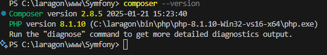  
  
-----------------------------------------------------------------------------------------------------------------------------------------------
# Etape 2 : Créer un dossier de projet :  
  
Création du dossier UNIT_SYMFONY :  
  
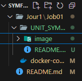  
  
-----------------------------------------------------------------------------------------------------------------------------------------------
# Etape 3 : Préparer le fichier docker-compose.yml :  
  
- **1 - Création du fichier  à la racine du projet :**  

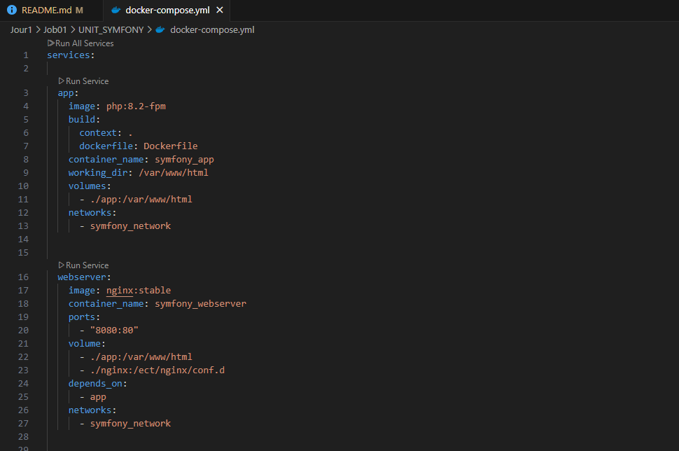  

- **2 - Explication du fichier docker-compose.yml :**  
  
Ce fichier définit plusieurs services (conteneurs) qui fonctionneront ensemble pour exécuter une application Symfony avec une base de données MySQL et des outils d'administration.  
.  
.  
.  

- **Le service app exécute l'application PHP avec PHP-FPM (FastCGI Process Manager).**  
```
app:
    image: php:8.2-fpm
```
Utilise l’image officielle de PHP version 8.2 avec FPM pour gérer l’exécution du code PHP.  
```
build:
    context: .
    dockerfile: Dockerfile
```
Permet de construire une image à partir d'un Dockerfile présent dans le même dossier (.).  
Si ce bloc est présent, image: php:8.2-fpm peut être redondant, car l’image sera construite à partir du Dockerfile.  
```
container_name: symfony_app
```
Donne un nom spécifique au conteneur : symfony_app au lieu d’un nom aléatoire généré par Docker.  
```
working_dir: /var/www/html
```
Définit le répertoire de travail à /var/www/html, où Symfony sera installé.  
```
volumes: 
    - ./app:/var/www/html
```
Monte le dossier local ./app dans le conteneur à /var/www/html, ce qui permet d’éditer le code en local et de voir les changements immédiatement sans reconstruire l’image.  
```
networks:
    - symfony_network
```
Connecte le service au réseau Docker symfony_network, permettant aux autres services de communiquer entre eux.   
.  
.  
.  

- **Le service webserver exécute un serveur Nginx pour exposer l’application PHP sur un navigateur.**  
```
webserver:
    image: nginx:stable
```
Utilise l’image stable de Nginx comme serveur web.  
```
container_name: symfony_webserver
```
Nom du conteneur : symfony_webserver.  
```
ports:
    - "8080:80"
```
Mappe le port 80 du conteneur (port par défaut de Nginx) sur le port 8080 de la machine hôte, ce qui permet d’accéder au site via http://localhost:8080.  
```
volume:
    - ./app:/var/www/html
    - ./nginx:/etc/nginx/conf.d
```
Monte deux volumes :

   1:  ./app est mappé sur /var/www/html pour que Nginx puisse servir les fichiers de l’application.  
   2:  ./nginx est mappé sur /etc/nginx/conf.d pour utiliser un fichier de configuration personnalisé de Nginx.  
```
depends_on:
    - app
```
Indique que ce conteneur dépend de app, donc il ne démarrera qu’après le conteneur PHP.  
```
networks:
    - symfony_network
```
Connecte le conteneur au réseau symfony_network.  
.  
.  
.  

- **Le service database crée une base de données MySQL 8.**  
```
database:
    image: mysql:8.0
``` 
Utilise l’image officielle MySQL 8.  
```
container_name: symfony_db
```
Nom du conteneur : symfony_db.  
```
environment:
    PMA_HOST: symfony_db
    MYSQL_ROOT_PASSWORD: root
    MYSQL_DATABASE: symfony
    MYSQL_USER: symfony
    MYSQL_PASSWORD: symfony
```
Définit les variables d’environnement pour configurer MySQL :  
    MYSQL_ROOT_PASSWORD=root → Mot de passe de l’utilisateur root.  
    MYSQL_DATABASE=symfony → Base de données créée automatiquement.  
    MYSQL_USER=symfony & MYSQL_PASSWORD=symfony → Utilisateur Symfony pour la base de données.  
```
ports:
    - "3306:3306"
```
Mappe le port 3306 du conteneur sur 3306 de la machine hôte, permettant d’accéder à MySQL depuis l’extérieur (localhost:3306).  
```
volumes:
    - db_data:/var/lib/mysql
```
Monte un volume db_data pour stocker les bases de données et éviter de perdre les données lors du redémarrage du conteneur.  
```
networks:
    - symfony_network
```
Connecte le conteneur MySQL au réseau symfony_network.  
.  
.  
.  

- **Le service adminer (Interface Web pour MySQL) ajoute une interface graphique pour gérer la base de données via un navigateur.**  
```
adminer:
    image: adminer
```
Utilise l’image officielle Adminer (alternative légère à PHPMyAdmin).  
```
container_name: symfony_adminer
```
Nom du conteneur : symfony_adminer.  
```
restart: always
```
S’assure que le conteneur redémarre automatiquement s’il plante.  
```
ports:
    - "8081:8080"
```
Mappe le port 8080 du conteneur (port par défaut d’Adminer) sur le port 8081 de la machine hôte → Accessible via http://localhost:8081.  
```
depends_on:
    - database
```
Attendra que le conteneur MySQL (database) soit prêt avant de démarrer.  
```
networks:
    - symfony_network
```
Connecte Adminer au réseau symfony_network.  
.  
.  
.  

- **Le service phpmyadmin ajoute une autre interface web pour MySQL, en plus d’Adminer.**  
```
phpmyadmin:
    image: phpmyadmin/phpmyadmin
```
Utilise l’image officielle phpMyAdmin.  
```
container_name: symfony_phpmyadmin
```
Nom du conteneur : symfony_phpmyadmin.  
```
restart: always
```
Redémarre automatiquement en cas de plantage.  
```
port:
    - "8082:80"
```
Mappe le port 80 du conteneur sur le port 8082 de l’hôte → Accessible via http://localhost:8082.  
```
environment:
    PMA_HOST: symfony_db
    MYSQL_ROOT_PASSWORD: root
```
Définit les variables :

    1 : PMA_HOST=symfony_db → Se connecte automatiquement à symfony_db.  
    2 : MYSQL_ROOT_PASSWORD=root → Mot de passe root de MySQL.  
```
depends_on:
    - database
```
Démarrera après la base de données.  
```
networks:
    - symfony_network
```
Connecté au réseau symfony_network.  
.  
.  
.  

- **Ce bloc définit le réseau :**  
```
networks:
  symfony_network:
    driver: bridge
```
Crée un réseau bridge (symfony_network), permettant la communication entre les conteneurs sans exposer leurs ports publiquement.  
.  
.  
.  

- **Ce bloc définit le volumes :**
```
volumes:
  db_data:
```
Crée un volume nommé db_data pour stocker les données MySQL de façon persistante, même après l’arrêt des conteneurs.  
.  
.  
.  

Avec ces fonctionnalités, cette application Symfony fonctionne dans un environnement isolé et répliquable avec Docker.  
  
-----------------------------------------------------------------------------------------------------------------------------------------------

- **3 - Créer un fichier de configuration Nginx :**  
  
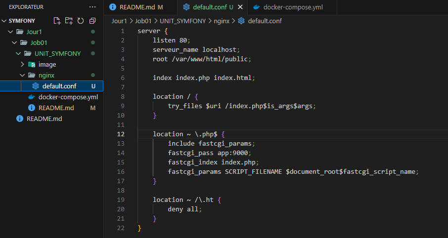  
  
- **4 -Explication du fichier default.conf (placé dans le dossier nginx) :**  

Ce fichier configure Nginx pour servir une application Symfony :  
.  
.  
.  

- **Bloc principal du serveur :**  
```
server {
    listen 80;
    server_name localhost;
    root /var/www/html/public;

    index index.php index.html;
```
→ listen 80; : Ce serveur écoute sur le port 80 (port HTTP par défaut).  

→ server_name localhost; : Définit le nom du serveur, ici localhost. Cela signifie que ce serveur Nginx servira les requêtes envoyées à localhost.  

→ root /var/www/html/public; : Définit le répertoire racine du site, où se trouvent les fichiers du projet Symfony (dossier public/).  

→ index index.php index.html; : Définit les fichiers par défaut à servir. Si un fichier index.php ou index.html est présent dans le répertoire demandé, il sera affiché automatiquement.  
.  
.  
. 

- **Gestion des URLs (Routes Symfony) :**  
```
location / {
    try_files $uri /index.php$is_args$args;
}
```
→ location / {} : Cette directive gère toutes les requêtes à la racine / du site.  

→ try_files $uri /index.php$is_args$args; :   

|__→→→→→→ $uri → Vérifie si l'URL demandée correspond à un fichier existant.  

|__→→→→→→ /index.php$is_args$args → Si aucun fichier correspondant n'est trouvé, la requête est envoyée à index.php avec les arguments éventuels ($is_args$args).  

|__→→→→→→ C'est un comportement typique pour Symfony : toutes les requêtes passent par index.php, qui gère le routage de l’application.  
.  
.  
.  

- **Gestion des fichiers PHP :**  
```
location ~ \.php$ {
    include fastcgi_params;
    fastcgi_pass app:9000;
    fastcgi_index index.php;
    fastcgi_param SCRIPT_FILENAME $document_root$fastcgi_script_name;
}
```
→ location ~ \.php$ {} : Cette règle s'applique à tous les fichiers PHP.  
  
→ include fastcgi_params; : Charge les paramètres FastCGI nécessaires pour exécuter du PHP.  
  
→ fastcgi_pass app:9000; :  
  
|__→→→→→ Indique que les requêtes PHP doivent être envoyées au conteneur nommé app (défini dans docker-compose.yml).  
|__→→→→→ Le port 9000 est celui utilisé par php-fpm pour exécuter les scripts PHP.  
  
→ fastcgi_index index.php; : Définit index.php comme fichier d'entrée pour les requêtes PHP.  
  
→ fastcgi_param SCRIPT_FILENAME $document_root$fastcgi_script_name;  
  
|__→→→→→ Définit le chemin absolu du fichier PHP à exécuter.  
|__→→→→→ $document_root est la valeur du root défini (/var/www/html/public).  
|__→→→→→ $fastcgi_script_name correspond au fichier PHP demandé.  
.  
.  
.  
  
- **Sécurité (Protectio des fichiers .htaccess) :**  
```
    location ~ /\.ht {
        deny all;
    }
}
```
→ location ~ /\.ht {} : Cette directive s’applique aux fichiers commençant par .ht (comme .htaccess).  
→ deny all; : Interdit l’accès à ces fichiers pour des raisons de sécurité (ils sont normalement utilisés avec Apache et ne doivent pas être exposés via Nginx).  
  
- **Résumé :**  
Ce fichier default.conf configure Nginx pour servir une application Symfony :  
→ Il redirige toutes les requêtes vers index.php, essentiel pour Symfony.  
→ Il utilise php-fpm via le service app pour exécuter les fichiers PHP.  
→ Il protège les fichiers .htaccess contre l’accès public.  
Il fonctionne avec ton docker-compose.yml, où :  
- app exécute php-fpm.  
- webserver (Nginx) communique avec app pour exécuter les fichiers PHP.  
- database stocke les données de l’application.  
  
-----------------------------------------------------------------------------------------------------------------------------------------------
- **5 - Création du ficher Dockerfile :**  
  
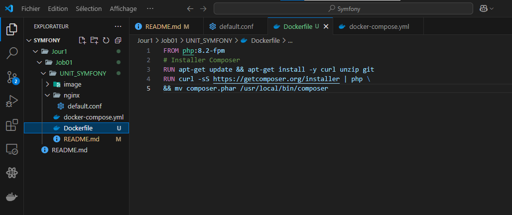  
   
- **6 - Explication du ficher Dockerfile :**  

Ce fichier est un Dockerfile, qui sert à construire une image Docker basée sur PHP 8.2 avec FPM (FastCGI Process Manager) et Composer.  
.  
.  
.  
  
```
FROM php:8.2-fpm
```
- L'image de base est php:8.2-fpm.  
- FPM (FastCGI Process Manager) est une version optimisée de PHP pour le traitement des requêtes web via un serveur comme Nginx ou Apache.  
- PHP est déjà installé avec cette image, donc pas besoin de l’ajouter.   
```
# Installer Composer
RUN apt-get update && apt-get install -y curl unzip git
```
- apt-get update : Met à jour la liste des paquets disponibles.  
- apt-get install -y curl unzip git : Installe trois outils :  
→ curl : pour télécharger des fichiers (nécessaire pour récupérer Composer).  
→ unzip : pour extraire des fichiers compressés.  
→ git : pour gérer des dépôts Git (utile pour les projets PHP).  
Le -y signifie "répondre oui automatiquement" pour éviter de bloquer l’installation.  
```
RUN curl -sS https://getcomposer.org/installer | php \
&& mv composer.phar /usr/local/bin/composer
```  
- curl -sS https://getcomposer.org/installer | php :
→ Télécharge et exécute le script d’installation de Composer depuis le site officiel.  
→ -sS : options de curl pour ne pas afficher les erreurs mineures et garder les erreurs importantes.  
- mv composer.phar /usr/local/bin/composer :  
→ Déplace le fichier composer.phar (l'exécutable de Composer) dans /usr/local/bin/. 
→ Cela permet d’exécuter composer directement dans le terminal, sans avoir à taper php composer.phar.  

- **Résumé :**  
Ce Dockerfile utilise PHP 8.2 avec FPM (serveur PHP optimisé). Il installe curl, unzip et git (nécessaires pour Composer et le développement PHP) et télécharge et installe Composer (le gestionnaire de dépendances PHP).  
  
-----------------------------------------------------------------------------------------------------------------------------------------------
# Etape 4 : Installer Symfony :  
  
- **1 - Se positionner dans le terminal de votre IDE/éditeur de code, dans le dossier de votre projet :**
  
Dans le terminal de l'IDE (ici VsCode) :  
```
cd chemin/du/dossier
```
Exemple :  
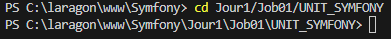  

- **2 - Installer les fichiers de Symfony dans le dossier app :**  
  
```
composer create-project symfony/website-skeleton app
```
- composer : C'est l'outil de gestion de dépendances PHP. Il permet d'installer des bibliothèques et des frameworks comme Symfony.  
- create-project : C'est l'option de Composer qui permet de créer un nouveau projet à partir d'un package spécifique.  
- symfony/website-skeleton : C'est le package source utilisé comme modèle pour le projet. Il contient la structure de base d'un site web Symfony avec plusieurs bundles préinstallés (Twig, Doctrine, etc.).  
- app : C'est le nom du dossier cible où Symfony sera installé.  

Résultat : 

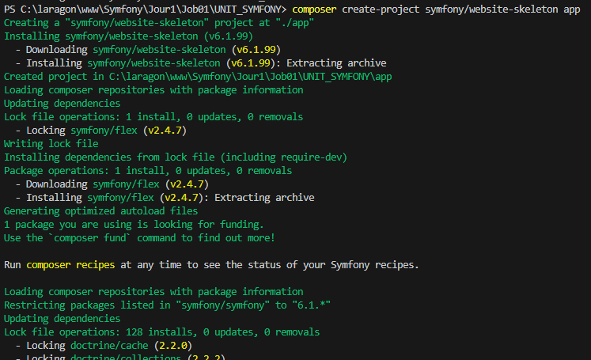  
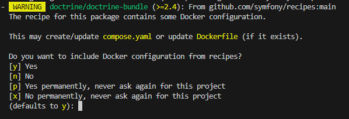  

J'ai taper y pour Yes.  
J'ai eu une erreur :  

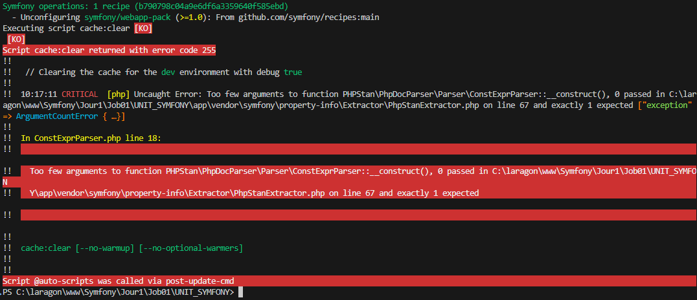  
  


