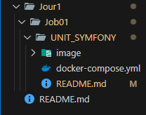

- # **Etape A :**  
  
# Etape 1 : Préparer l'environnement :  
  
- **Installer Docker et Docker compose :**  
  
Pour vérifier que Docker est installé et configuré, ouvrir un terminal et entrer :  
```
docker --version
```  
  
Résultat si docker est installé :  
    
  
  
-----------------------------------------------------------------------------------------------------------------------------------------------
Pour vérifier que Docker Compose est installé et configurer, ouvrir un terminal et entrer :
```
docker-compose --version
```  
  
Résultat sit Docker compose est installé :  
  
  
  
-----------------------------------------------------------------------------------------------------------------------------------------------
- **Installer Composer :**  
  
Puisque Symfony utilise Composer pour fonctionner, il faut vérifier qu'il soit bien installé et configuré :  
```
composer --version
```  

et pour le mettre a jour sous Windows :  
```
composer sefl-upgrade
```
  
Résultat si Composer est installé :  
  
  

-----------------------------------------------------------------------------------------------------------------------------------------------
# Etape 2 : Créer un dossier de projet :  
  
Création du dossier UNIT_SYMFONY :  
  
  

-----------------------------------------------------------------------------------------------------------------------------------------------
# Etape 3 : Préparer le fichier docker-compose.yml :  
  
- **1 - Création du fichier  à la racine du projet :**  

  

- **2 - Explication du fichier docker-compose.yml :**  
  
Ce fichier définit plusieurs services (conteneurs) qui fonctionneront ensemble pour exécuter une application Symfony avec une base de données MySQL et des outils d'administration.  
.  
.  
.  

- **Le service app exécute l'application PHP avec PHP-FPM (FastCGI Process Manager).**  
```
app:
    image: php:8.2-fpm
```
Utilise l’image officielle de PHP version 8.2 avec FPM pour gérer l’exécution du code PHP.  
```
build:
    context: .
    dockerfile: Dockerfile
```
Permet de construire une image à partir d'un Dockerfile présent dans le même dossier (.).  
Si ce bloc est présent, image: php:8.2-fpm peut être redondant, car l’image sera construite à partir du Dockerfile.  
```
container_name: symfony_app
```
Donne un nom spécifique au conteneur : symfony_app au lieu d’un nom aléatoire généré par Docker.  
```
working_dir: /var/www/html
```
Définit le répertoire de travail à /var/www/html, où Symfony sera installé.  
```
volumes: 
    - ./app:/var/www/html
```
Monte le dossier local ./app dans le conteneur à /var/www/html, ce qui permet d’éditer le code en local et de voir les changements immédiatement sans reconstruire l’image.  
```
networks:
    - symfony_network
```
Connecte le service au réseau Docker symfony_network, permettant aux autres services de communiquer entre eux.   
.  
.  
.  

- **Le service webserver exécute un serveur Nginx pour exposer l’application PHP sur un navigateur.**  
```
webserver:
    image: nginx:stable
```
Utilise l’image stable de Nginx comme serveur web.  
```
container_name: symfony_webserver
```
Nom du conteneur : symfony_webserver.  
```
ports:
    - "8080:80"
```
Mappe le port 80 du conteneur (port par défaut de Nginx) sur le port 8080 de la machine hôte, ce qui permet d’accéder au site via http://localhost:8080.  
```
volume:
    - ./app:/var/www/html
    - ./nginx:/etc/nginx/conf.d
```
Monte deux volumes :

   1:  ./app est mappé sur /var/www/html pour que Nginx puisse servir les fichiers de l’application.  
   2:  ./nginx est mappé sur /etc/nginx/conf.d pour utiliser un fichier de configuration personnalisé de Nginx.  
```
depends_on:
    - app
```
Indique que ce conteneur dépend de app, donc il ne démarrera qu’après le conteneur PHP.  
```
networks:
    - symfony_network
```
Connecte le conteneur au réseau symfony_network.  
.  
.  
.  

- **Le service database crée une base de données MySQL 8.**  
```
database:
    image: mysql:8.0
``` 
Utilise l’image officielle MySQL 8.  
```
container_name: symfony_db
```
Nom du conteneur : symfony_db.  
```
environment:
    PMA_HOST: symfony_db
    MYSQL_ROOT_PASSWORD: root
    MYSQL_DATABASE: symfony
    MYSQL_USER: symfony
    MYSQL_PASSWORD: symfony
```
Définit les variables d’environnement pour configurer MySQL :  
    MYSQL_ROOT_PASSWORD=root → Mot de passe de l’utilisateur root.  
    MYSQL_DATABASE=symfony → Base de données créée automatiquement.  
    MYSQL_USER=symfony & MYSQL_PASSWORD=symfony → Utilisateur Symfony pour la base de données.  
```
ports:
    - "3306:3306"
```
Mappe le port 3306 du conteneur sur 3306 de la machine hôte, permettant d’accéder à MySQL depuis l’extérieur (localhost:3306).  
```
volumes:
    - db_data:/var/lib/mysql
```
Monte un volume db_data pour stocker les bases de données et éviter de perdre les données lors du redémarrage du conteneur.  
```
networks:
    - symfony_network
```
Connecte le conteneur MySQL au réseau symfony_network.  
.  
.  
.  

- **Le service adminer (Interface Web pour MySQL) ajoute une interface graphique pour gérer la base de données via un navigateur.**  
```
adminer:
    image: adminer
```
Utilise l’image officielle Adminer (alternative légère à PHPMyAdmin).  
```
container_name: symfony_adminer
```
Nom du conteneur : symfony_adminer.  
```
restart: always
```
S’assure que le conteneur redémarre automatiquement s’il plante.  
```
ports:
    - "8081:8080"
```
Mappe le port 8080 du conteneur (port par défaut d’Adminer) sur le port 8081 de la machine hôte → Accessible via http://localhost:8081.  
```
depends_on:
    - database
```
Attendra que le conteneur MySQL (database) soit prêt avant de démarrer.  
```
networks:
    - symfony_network
```
Connecte Adminer au réseau symfony_network.  
.  
.  
.  

- **Le service phpmyadmin ajoute une autre interface web pour MySQL, en plus d’Adminer.**  
```
phpmyadmin:
    image: phpmyadmin/phpmyadmin
```
Utilise l’image officielle phpMyAdmin.  
```
container_name: symfony_phpmyadmin
```
Nom du conteneur : symfony_phpmyadmin.  
```
restart: always
```
Redémarre automatiquement en cas de plantage.  
```
port:
    - "8082:80"
```
Mappe le port 80 du conteneur sur le port 8082 de l’hôte → Accessible via http://localhost:8082.  
```
environment:
    PMA_HOST: symfony_db
    MYSQL_ROOT_PASSWORD: root
```
Définit les variables :

    1 : PMA_HOST=symfony_db → Se connecte automatiquement à symfony_db.  
    2 : MYSQL_ROOT_PASSWORD=root → Mot de passe root de MySQL.  
```
depends_on:
    - database
```
Démarrera après la base de données.  
```
networks:
    - symfony_network
```
Connecté au réseau symfony_network.  
.  
.  
.  

- **Ce bloc définit le réseau :**  
```
networks:
  symfony_network:
    driver: bridge
```
Crée un réseau bridge (symfony_network), permettant la communication entre les conteneurs sans exposer leurs ports publiquement.  
.  
.  
.  

- **Ce bloc définit le volumes :**
```
volumes:
  db_data:
```
Crée un volume nommé db_data pour stocker les données MySQL de façon persistante, même après l’arrêt des conteneurs.  
.  
.  
.  

Avec ces fonctionnalités, cette application Symfony fonctionne dans un environnement isolé et répliquable avec Docker.  

-----------------------------------------------------------------------------------------------------------------------------------------------

- **3 - Créer un fichier de configuration Nginx :**  
  
  
  
- **4 -Explication du fichier default.conf (placé dans le dossier nginx) :**  

Ce fichier configure Nginx pour servir une application Symfony :  
.  
.  
.  

- Bloc principal du serveur :  
```
server {
    listen 80;
    server_name localhost;
    root /var/www/html/public;

    index index.php index.html;
```
→ listen 80; : Ce serveur écoute sur le port 80 (port HTTP par défaut).  

→ server_name localhost; : Définit le nom du serveur, ici localhost. Cela signifie que ce serveur Nginx servira les requêtes envoyées à localhost.  

→ root /var/www/html/public; : Définit le répertoire racine du site, où se trouvent les fichiers du projet Symfony (dossier public/).  

→ index index.php index.html; : Définit les fichiers par défaut à servir. Si un fichier index.php ou index.html est présent dans le répertoire demandé, il sera affiché automatiquement.  
.  
.  
. 

- Gestion des URLs (Routes Symfony) :  
```
location / {
    try_files $uri /index.php$is_args$args;
}
```
→ location / {} : Cette directive gère toutes les requêtes à la racine / du site.  

→ try_files $uri /index.php$is_args$args :   

→→→→→→ $uri → Vérifie si l'URL demandée correspond à un fichier existant.  

→→→→→→ /index.php$is_args$args → Si aucun fichier correspondant n'est trouvé, la requête est envoyée à index.php avec les arguments éventuels ($is_args$args).  

→→→→→→ C'est un comportement typique pour Symfony : toutes les requêtes passent par index.php, qui gère le routage de l’application.  


